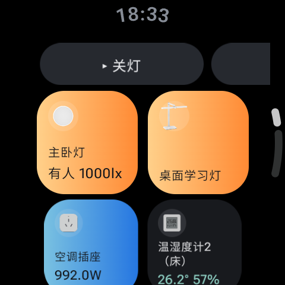
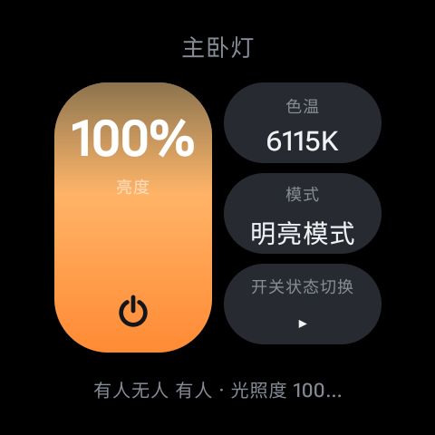

<div align="center">


# 小腕管家 · HomeWrist

**Wear OS 平台的第三方米家（Mijia）智能家居客户端**

[](LICENSE)


[English](README.en.md) · 中文

</div>

---

## 摘要

本项目在 Wear OS 手表上实现米家智能家居设备的直接控制。手表经由配对手机的蓝牙代理与小米云端通信，因而既不依赖 Home Assistant 等中间服务，也不要求手表接入 Wi‑Fi。区别于依赖逐型号适配表的常规实现，本项目在运行时依据 MIoT‑Spec‑V2 规范推导设备控件，从而在无需修改代码的前提下支持任意型号、固件与品类。项目在 Galaxy Watch 7（Wear OS 6 / Android 16 / 480×480 圆形屏）上完成开发与验证。

<div align="center">
<table>
  <tr>
    <td align="center" width="260">
      <br/>
      <sub><b>图 1</b> &nbsp; 设备列表：顶部场景行、按房间分组的磁贴</sub>
    </td>
    <td align="center" width="260">
      <br/>
      <sub><b>图 2</b> &nbsp; 设备详情：竖向滑块、枚举选择、实时读数</sub>
    </td>
  </tr>
</table>
<sub>Galaxy Watch 7（480×480）真机截图；设备名称已作匿名化处理。</sub>
</div>

## 功能

- **扫码登录。** 使用米家 App 扫描手表显示的二维码完成鉴权。扫码行为本身构成第二验证因子，故无需处理图形验证码或二次验证流程。
- **设备列表。** 收藏设备固定于首屏，其余按房间分组；传感器读数直接呈现于磁贴。
- **手动场景。** 列表顶部以横向条目展示手动场景，单次点击即触发；另提供独立的场景 Tile。
- **设备详情。** 竖向滑块调节亮度、温度等连续量（存在多个连续量时可切换）；枚举属性经浮层选择；无入参动作单击即发。对空调设定温度、扫地机吸力等**单入参动作**，浮层选择档位后直接下发。
- **表盘组件。** 提供两个 Tile（2×3 设备开关网格、2×3 场景网格）与一个表盘 Complication（首个收藏设备的开关状态）。
- **本地化。** 界面语言跟随系统（中文 / 英文），设备属性标签同样随系统语言呈现。

## 控件推导方法

所有可交互控件均在运行时依据 [MIoT‑Spec‑V2](https://iot.mi.com/new/doc/design/spec/overview) 规范推导，不含任何硬编码的属性标识（`piid`）。流程为：拉取设备规范（spec），按属性与动作的类别将其归约为开关、滑块、枚举、只读量与动作五类控件。由于归约仅依赖类别而非具体标识，更换型号、固件或品类均无需改动代码。

各归约规则的取舍及其依据记录于 [`core/.../MiSpec.kt`](core/src/main/kotlin/dev/liji/mihome/core/MiSpec.kt) 的注释中，每条规则均对应一个在真实语料上观测到的失败案例。例如：将属性白名单用作准入门禁会使约 20% 的型号呈现为空卡片；仅按同名类别匹配主服务会导致摄像机（其服务名为 `camera-control`）无任何控件。

## 覆盖率评估

以 `./mi audit` 对 miot‑spec.org 公开语料抽样测量（457 个型号 / 177 个品类）：

| 指标 | 结果 |
|---|---:|
| 可推导出常用控件的型号占比 | **86.9%** |
| 可识别电源开关的型号占比 | 36.1% |
| 每型号常用控件数中位数 | 4 |

其余 13.1% 主要为规范中不含任何可读写成员的设备（如追踪器、智能杯等仅上报事件的型号），以及少数仅暴露厂商私有服务的型号。

## 场景协议

米家场景相关的云端接口无公开文档，其端点经本项目实测确定。网络上流传的若干端点路径均已失效，实际可用接口如下：

```
列表   appgateway/miot/appsceneservice/AppSceneService/GetSceneList
       { "home_id": <整数> }

执行   appgateway/miot/appsceneservice/AppSceneService/NewRunScene
       { "scene_id": "…", "scene_type": 2, "trigger_key": "user.click" }
```

实测确认三处易致实现失效的要点：

1. 同一服务下的 `RunScene`（无 `New` 前缀）返回 `code:0`、`result:true`，但设备并不执行动作；仅 `NewRunScene` 真正生效。
2. `scene_type` 为必填字段且须取值 `2`；其与场景记录中恒为 `0` 的 `type` 字段无关。
3. 手动场景须以 `scene_trigger.triggers[].src == "user"` 为条件筛选，否则定时与传感器触发的自动化将混入列表。

## 系统架构

项目分为两个模块：`:core` 为不含任何 Android 依赖的纯 JVM 协议实现与命令行工具；`:wear` 为基于 Compose for Wear OS 的界面层。

此划分的目的在于**将验证过程从手表转移至桌面**。一次完整的设备端部署需经局域网并等待手表唤醒，耗时逾十分钟；而命令行工具 `./mi list` 与手表运行完全相同的代码路径（同一 `toControls` 归约、同一值渲染逻辑），可在秒级内呈现每台设备的渲染结果。

```
core/   MiCrypto 签名 · MiHttp · MiAuth 登录状态机 · MiApi · MiSpec 归约 · MiFormat 渲染
wear/   AppModel 状态持有 · Ui 界面 · MiTileService / SceneTileService · MiComplicationService · SpecCache
```

## 构建

环境要求：JDK 21 与 Android SDK（compileSdk 36）。

```bash
./gradlew :wear:assembleRelease
adb install -r wear/build/outputs/apk/release/wear-release.apk
adb shell cmd package compile -m speed -f dev.liji.mihome   # 可选：立即完成 AOT 编译
```

建议日常使用安装 **release** 构建。`debuggable` 标志会禁用相当一部分 ART 优化，进而导致快速滚动时掉帧（已在设备上经 A/B 对比确认）。构建已内置 baseline profile，系统最终会自行对热点路径进行 AOT 编译；上述 `compile` 命令仅用于使其即时生效。需经 `run-as` 读取日志时，改用 `assembleDebug`。

> 本仓库 `settings.gradle.kts` 采用阿里云镜像源，因 `dl.google.com` 在中国大陆不可直连。境外用户可将 `google()` 置于源列表首位。

## 命令行工具

`./mi <命令>`（包装脚本会注入 `JAVA_HOME`）。所有子命令均在桌面执行，无需连接手表。

```bash
./mi login-qr                  # 终端渲染二维码，供米家 App 扫描
./mi list                      # 输出与手表列表界面一致的内容
./mi scenes                    # 列出手动场景（不含自动化）
./mi scene-run <sceneId>       # 执行指定手动场景
```

<details>
<summary>完整命令参考</summary>

```bash
./mi devices                   # 列出全部设备及其真实 spec_type
./mi controls-urn <urn>        # 输出 toControls 对指定型号推导出的控件
./mi get <did> <siid> <piid>
./mi set <did> <siid> <piid> <value>
./mi action <did> <siid> <aiid> [args…]
./mi audit [每品类抽样数]        # 以全量语料评估归约规则的覆盖率
./mi region [detect|<code>]    # 查看 / 探测 / 指定账号所属区域
./mi raw <path> [json]         # 原样输出端点响应
```

### 可选：预置设备规范与图标

首次启动时，手表需为每个未知型号拉取规范（并发度 3，附进度提示）。若欲省去此步骤，可在构建前将自有设备的规范与米家原生图标打包进 APK：

```bash
./mi bundle wear/src/main/assets/spec $(./mi devices | grep -o 'urn:[^ ]*' | sort -u)
./mi icons  wear/src/main/assets/icon
```

上述两目录已列入 `.gitignore`，其内容取决于用户自有设备。缺失时应用仍可运行：规范将在运行时拉取并缓存，图标将回退为按品类自绘的图形。图标于构建期自 `home.miot-spec.com` 获取（`productId` 无官方来源），故应用在运行时不访问任何第三方站点。

</details>

## 面向任意账号的适配

应用不含任何与作者环境相关的特化处理：

- **区域自动探测。** 登录流程全球统一，但业务接口按区域划分（境外前缀为 `de.` / `sg.` / `us.` / `ru.` / `i2.` / `tw.`）。区域选择错误的表现为「登录成功但无任何设备」，属最难自查的一类故障，故不交由用户选择：登录后逐一探测各区域，采用首个返回非空家庭列表者，结果持久化保存。
- **全部家庭。** 单账号绑定多处住所属常见情形；仅读取首个家庭将使其余设备完全不可见。
- **收藏初始化。** 首次启动自动收藏前 3 个可开关设备，此后以用户在详情页的选择为准。
- **会话失效处理。** 会话彻底失效时直接返回登录界面，而非停留于无法自解的错误提示。
- **离线状态标注。** 刷新失败时于列表顶部提示「离线 · 显示上次状态」；Tile 超过 30 分钟未同步时于对应格加淡色标记。过期状态不冒充实时状态。
- **属性分批读取。** `prop/get` 每批至多 80 个属性，避免设备较多的家庭超出请求体上限。

## 局限性

- **不支持多入参动作。** 已支持单入参动作（浮层选择单一取值）；在 33mm 圆形屏上依次填入多个入参的交互成本过高，未予实现。
- **不实现完整的二次验证流程。** 扫码登录本身即为第二因子；遇图形验证码时请改用扫码登录。
- **部分枚举值无官方译文**（如音箱播放状态 `Stop`），照原文呈现，不作臆测翻译。
- **场景执行仅报告「已下发」。** 云端返回 `code:0` 不足以证明设备已执行，且无可回读的凭据，故不作虚假确认。

## 协议来源与合规声明

登录与控制所用接口与米家 App 一致，由公开资料与流量抓包整理而得，未复用任何第三方项目代码。小米 `LegalNotice` 声称在非 Home Assistant 平台使用其云接口构成侵权。本项目为独立的非官方实现，仅供个人自用与学习研究，与小米公司无任何隶属或认可关系。「Mi Home」「Mijia」「米家」为小米公司商标，此处出现仅用于说明互操作性。使用前请自行评估相关法律风险。

本项目以 [MIT 许可证](LICENSE) 发布。
